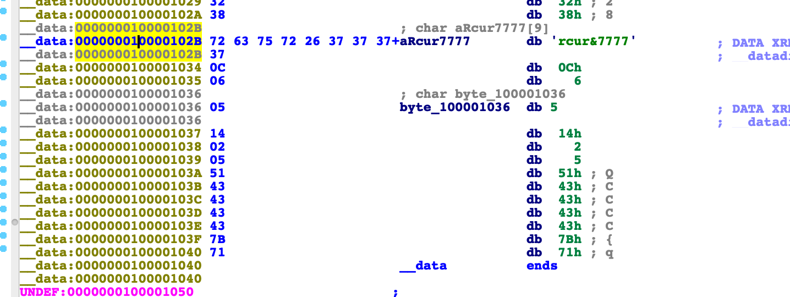

## 编译Armariris

```
git clone git@github.com:gossip-sjtu/Armariris.git
```

编译

```shell
cd Armariris
mkdir build
cd build
cmake ../
```

测试文件内容如下:

```c
#include <stdio.h>

void fun(){
	printf("test 3333\n");
}

int main(int argc, char *argv[]) {
	printf("test 1111\n");
	printf("test 2222\n");
	fun();
	return 0;
}

```

使用编译好的llvm编译这个测试的文件

```shell
clang -isysroot /Applications/Xcode.app/Contents/Developer/Platforms/MacOSX.platform/Developer/SDKs/MacOSX.sdk -mllvm -sobf test.c -o test
```

使用isysroot指定sdk，然后使用`-mllvm -sobf`开启字符串混淆

## Armariris是如何进行字符串混淆的

我们直接看使用ida反汇编出来的代码

```c++
int __cdecl main(int argc, const char **argv, const char **envp)
{
  printf(aRcur7777, argv, envp);
  printf(&byte_100001036);
  fun();
  return 0;
}
```

可以看到有两个printf函数打印了一些数据出来，我们点第一个打印的字符串，双击`aRcur7777`跳转到
字符串定义位置，这个字符串在data段



这个字符串我们本来输出的是`test 1111`这里显然不是，我们查看`aRcur7777`的交叉引用，发现两处，
其中一处是main函数中的printf，另一处应该就是还原这个字符串的位置了


所以`__datadiv_decode14953400483976599729`这个函数就是还原这个字符的函数，我们看他是如何做的还原
。跳转过去按F5反编译，得到的结果如下:

```cpp
__int64 datadiv_decode14953400483976599729()
{
  bool v0; // ST23_1
  bool v1; // ST17_1
  __int64 result; // rax
  bool v3; // ST0B_1
  unsigned int v4; // [rsp+8h] [rbp-1Ch]
  unsigned int v5; // [rsp+14h] [rbp-10h]
  unsigned int v6; // [rsp+20h] [rbp-4h]

  v6 = 0;
  do
  {
    aLKl[v6] ^= 0x38u;
    v0 = v6++ < 0xA;
  }
  while ( v0 );
  v5 = 0;
  do
  {
    aRcur7777[v5] ^= 6u;
    v1 = v5++ < 0xA;
  }
  while ( v1 );
  v4 = 0;
  do
  {
    byte_100001036[v4] ^= 0x71u;
    result = v4 - 10;
    v3 = v4++ < 0xA;
  }
  while ( v3 );
  return result;
}
```

我们可以看到`aRcur7777`的还原是和6做了异或操作，那我们来验证一下是否是我们看到的这样。

`aRcur7777`的原始数据是`[0x72, 0x63, 0x75, 0x72, 0x26, 0x37, 0x37, 0x37, 0x37]`

每一位和6异或之后的结果是`[0x74, 0x65, 0x73, 0x74, 0x20, 0x31, 0x31, 0x31, 0x31]`

对于的ascii字符串就是`test 1111`


